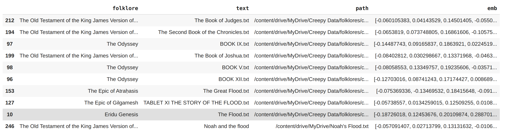

# folder hierarchy

Folders:

- `scraper` is the Scrapy folk songs scrapers.

  Currently it has three scrapers.

  1. [songs archive](http://songbat.com/archive/)
  2. [round number index](https://en.wikipedia.org/wiki/List_of_folk_songs_by_Roud_number?oldformat=true)
  3. [library guides](https://libraryguides.missouri.edu/c.php?g=1052498&p=7642280) For ATU index dataset

- `datasets` contains the datasets

  Use DVC to version track the dataset

- `utils` contains some helper functions and scripts


Nerve Sparing Left and Right

# Mythology

## 1. dataset

We explore the mythological stories scraped from online sources, and collect those into `/content/drive/MyDrive/Creepy Data/folklores/folklore_noATU.h5`

7000 folklores obtained by scraping myriad sources


for details see `scripts/folklores.py`

&nbsp;


This is one case study where we plot the embeddings produced by S-BERT model with the T-SNE and also plot the 3 stories that are highly relevant to the flood (Gilgamesh Tablet XI, Eridu Genesis the flood, and Genesis Noah and the flood)


Here all the embeddings with the same origin appears to be clustered together, suggesting that the embedding does persevere a semantic similarity 

Also we claims that this is not only because the luck of picking the best perplexity in T-SNE, since we also calcualte the cosine similiarty of the 3 flood stories, for example this is the top 10 most similar stories of the Eridu Genesis (no particular ordering) and both the Gilgamesh and Genesis are listed in the top 10 neighbors.

[for code that generate these 2 graphs, see `scripts/folklores.py::case_study`]

# ATU index

## 1. dataset

We explore the folklores scraped from the [library guides](https://libraryguides.missouri.edu/c.php?g=1052498&p=7642280) plus [MFTD](https://sites.ualberta.ca/~urban/Projects/English/Content/ATU_Tales.htm), and put the results in the `ATU.h5`in the key `default`

for details see `scripts/atu.py`

It contains 1955 stories with 13 columns each

1. atu

   corresponding ATU index

2. desc

   the description of the ATU index

3. title

   the name of the story

4. origin

   where the story comes from, it can either be the author or the country where the story is originated in

5. text

   the raw uncleaned text of the story

6. url

   the original url from which the text is collected, if it’s a xml then it’s collected from MFTD

7. SBERT

   the embedding produced by the pretrained Sentence BERT model `paraphrase-distilroberta-base-v1`

   see `utils/Embeddings.py` for details on how we got the embeddings

8. LF

   the embedding produced by the pretrained LongFormer model `longformer-base-4096`

   see `utils/Embeddings.py` for details on how we got the embeddings

9. from_xml

   if true, the story is collected from MFTD, otherwise it’s collected from library guides

10. language

    although the text is always in English, some are translated, and this column indicates the original language

11. clean-text

    this is the cleaned text from the raw text, and this would be used to calculate the TF-IDF vector

12. TFIDF

    this is the TF-IDF vector for each story, it is represented as a dictionary where the key is the token in the clean-text, while the value is the corresponding TF-IDF value

13. motif

    each ATU index has a motif/super category

    - if 1 ≤ ATU ≤ 299: animal tales
    - if 300 ≤ ATU ≤ 749: tales of magic
    - if 700 ≤ ATU ≤ 849: religious tales

    - if 850 ≤ ATU ≤ 999: realistic tales
    - if 1000 ≤ ATU ≤ 1169: tales of the stupid ogre (giant, devil)
    - if 1200 ≤ ATU ≤ 1999: anecdotes and jokes
    - if 2000 ≤ ATU ≤ 2399: formula tales

TODO freq plot

This is the top 10 most common ATU indexes

`df.groupby(["atu", "desc"]).count()["title"].sort_values(ascending=False)[:10]`

```
atu   desc                                                        counts
275A  Tortoise and Hare race                                      33
480   The Kind and the Unkind Girls                               28
980   Ungrateful Son                                              28
748   Queen Jelaous of Peasant Couple                             27
500   Name of the Supernatureal helper Rumpelstiltskin            26
510B  Peau d'Asne Cap o' Rushes Father wants to marry daughter    24
510A  Cinderella                                                  24
1430  Air Castles                                                 21
155   Ingratitude Is the World's Reward                           21
1540  The student from Paradise (Paris)                           20
```


We found that clustering based on individual category is difficult, here we pick the ATU indexs that contains more than 20 stories, and use Longformer embedding with T-SNE perplexity = 50 to visualize


although there are some clustering among these 7 ATU indexs, it is generally difficult to make a hard clustering

[for the code that generate the above graph, see `scripts/atu.py::tsne_visualization`]


What’s more, clustering on
